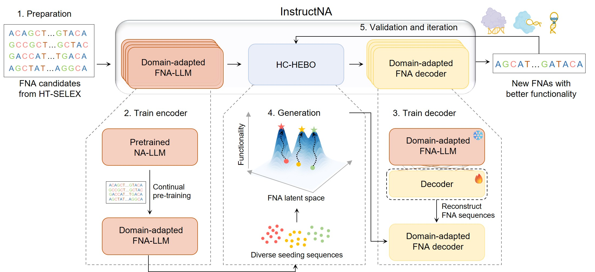

# ***InstructNA***

**Functional nucleic acids (FNAs)** are essential for designing advanced molecular tools across multiple fields, yet their *de novo* design faces challenges due to the vast sequence space and inefficiency of experimental screening methods. Nucleic acid large language models (NA-LLMs) offer new opportunities for FNA design, but their generative capabilities remain underexplored. Here, we introduce **InstructNA**, a novel framework that leverages NA-LLMs augmented with high-throughput SELEX (HT-SELEX) to guide *de novo* design of FNAs **without relying on structural information**.



---

# ***Environment Setup***

- **OS**: Ubuntu 20.04  
- **Python**: 3.9  
- **CUDA**: 12.6  
- **Main Dependencies**:  
  - `torch==2.7.1`  
  - `transformers==4.53.2`  
  - `HEBO==0.3.6`  

## Create Environment with Conda

```bash
conda create -n InstructNA python=3.9
conda activate InstructNA
git clone https://github.com/zhimingzhang275/InstructNA.git
cd InstructNA
pip install -r requirements.txt
```

# ***Usage***

InstructNA is framework for activity-guided nucleic acid sequence design.  
The complete workflow can be divided into **three major stages**:

1. **Model Training**
2. **Activity Seed Construction (Optional, please see the `./examples/DNABERT_3mers/seeds_construct/readme.md`)**
3. **Activity-Guided Sequence Generation**

Depending on whether you already have activity-labeled sequences, you can flexibly use different parts of the pipeline.

All scripts in this directory are implemented using **Hydra configuration**.  
You can modify the configuration files in `./examples/DNABERT_3mers/conf` to control script behavior.

## 1. Model Training

The training of the **InstructNA** model is carried out in **two stages**: the **encoder training stage** followed by the **decoder training stage**. This two-stage pipeline is fully automated through a single training script. Once the dataset path is specified, the training process will start automatically.

### Dataset Format

The dataset should be provided as a plain text file, where **each line contains a fixed-length, unique sequence** extracted from the SELEX FASTQ data (typically from the final SELEX rounds).  
An example dataset is shown below:

```csv
ACCCTAATTATATTAATTAG
AATTAGCGACTAATTACAAA
AATTAGCTTTAATTTTATTA
```

### Running the Training Script
After preparing the dataset, launch the training process with the following command:
```python
python examples/DNABERT_3mers/separately_train.py dataset.dir=/PATH/TO/DATASET
```

For detailed parameter configurations, please refer to `examples/DNABERT_3mers/conf/separately_train.yaml`.


## 2. Activity Seed Construction (Optional)

If you already have sequences with corresponding activity labels, this step can be skipped.  
Otherwise, we provide a systematic approach to construct seed sequences and obtain their activity measurements.

For detailed instructions, please refer to  **`./examples/DNABERT_3mers/seeds_construct/readme.md`**.

## 3. Activity-Guided Sequence Generation

After preparing the **seed sequences** and their corresponding **activity labels**, you can perform **activity-guided sequence generation** with InstructNA using the script below.

### Input Data Format

The sequence–activity file must be provided in the following CSV format:

```csv
init_seq,gen_seq,act
GTCATAGTAGAGGTTTCCATGGTCTTTTTC,GTCATAGTAGAGGTTTCCATGGTCTTTTTC,0.389029964
TCCGTTTTAGTGGACTAGGCGCCTAACGAG,TCCGTTTTAGTGGACTAGGCGCCTAACGAG,0.269304099
GGCTGTCTTCCTCCAGAATCTAACTCCGGG,GGCTGTCTTCCTCCAGAATCTAACTCCGGG,0.012030075
```
- **init_seq**: the original seed sequence  
- **gen_seq**: the generated sequence (initially identical to `init_seq`)  
- **act**: the measured activity value

### Running Activity-Guided Generation

Run the following command to generate new candidate sequences:

```python
python examples/DNABERT_3mers/single_HC-HEBO_inference.py \  
  paths.SELEX_path=/PATH/TO/DATASET \                   # format: one SELEX sequence per line 
  paths.seq_act_path=/PATH/TO/SEQ_ACT_PATH \            # sequence–activity file 
  paths.InstructNA_model_path=/PATH/TO/INSTRUCTNA_CKPT  #  InstructNA model checkpoint
```
For detailed parameter settings and advanced options, please refer to: `examples/DNABERT_3mers/conf/single_hc_hebo_inference.yaml`.

### Output Format
The script outputs a CSV file with the following format:
```csv
init_seq,gen_seq,act
GTCATAGTAGAGGTTTCCATGGTCTTTTTC,GTCATAGTAGAGGTTTCCATGGTCTTTTTC,0.389029964
GTCATAGTAGAGGTTTCCATGGTCTTTTTC,TAACGGGTTATGATCTCCAACTCACTAATA,None
TCCGTTTTAGTGGACTAGGCGCCTAACGAG,TCCGTTTTAGTGGACTAGGCGCCTAACGAG,0.269304099
TCCGTTTTAGTGGACTAGGCGCCTAACGAG,TCCATCACCCGTCAGTTTATCCAAGCCACC,None
GGCTGTCTTCCTCCAGAATCTAACTCCGGG,GGCTGTCTTCCTCCAGAATCTAACTCCGGG,0.012030075
GGCTGTCTTCCTCCAGAATCTAACTCCGGG,TCATAAACAAAGGCCAGACCAAATTATTCT,None
```
- Rows where **act = None** correspond to **newly generated sequences**.
- These sequences should be **experimentally measured** in the next round.

### Iterative Generation

After obtaining activity measurements for the newly generated sequences, update the CSV file by replacing `None` with the measured activity values:

```csv
init_seq,gen_seq,act
GTCATAGTAGAGGTTTCCATGGTCTTTTTC,GTCATAGTAGAGGTTTCCATGGTCTTTTTC,0.389029964
GTCATAGTAGAGGTTTCCATGGTCTTTTTC,TAACGGGTTATGATCTCCAACTCACTAATA,0.124121221
TCCGTTTTAGTGGACTAGGCGCCTAACGAG,TCCGTTTTAGTGGACTAGGCGCCTAACGAG,0.269304099
TCCGTTTTAGTGGACTAGGCGCCTAACGAG,TCCATCACCCGTCAGTTTATCCAAGCCACC,0.214124124
GGCTGTCTTCCTCCAGAATCTAACTCCGGG,GGCTGTCTTCCTCCAGAATCTAACTCCGGG,0.012030075
GGCTGTCTTCCTCCAGAATCTAACTCCGGG,TCATAAACAAAGGCCAGACCAAATTATTCT,0.124124122
```
Then rerun the generation script using the updated file to perform the next round of activity-guided optimization.


# ***A pipeline for optimizing public Transcription Factor(TF) binding specificity using InstructNA***
To validation the performance of InstructNA. We use the public SELEX datasets from [**DNA-Binding Specificities of Human Transcription Factors**](https://www.cell.com/cell/pdf/S0092-8674(12)01496-1.pdf), and the PBM data from the [**Evaluation of methods for modeling transcription factor sequence specificity**](https://www.nature.com/articles/nbt.2486). Take test data for example, the pipeline script is as follows:


## 1. Train
```python
python examples/DNABERT_3mers/separately_train.py \
  dataset.dir=data/test_data/Srebf1_train_data.csv
  checkpoint.save_path=output/model_save/
```

## 2. Run pipeline
```python
python examples/DNABERT_3mers/TFs_InstrcutNA_pipeline.py \
  paths.fastq=data/test_data/Srebf1_TACATT20NCG_Z_4.fastq \ # TF's SELEX fastq file
  paths.label=data/test_data/pTH0914_HK_8mer.raw \          # TF's PBM label data
  paths.model= output/model_save/final_model                # TF's InstructNA model checkpoint 
```

For detailed parameter settings and advanced options, please refer to: `examples/DNABERT_3mers/conf/TFs_pipeline.yaml`.