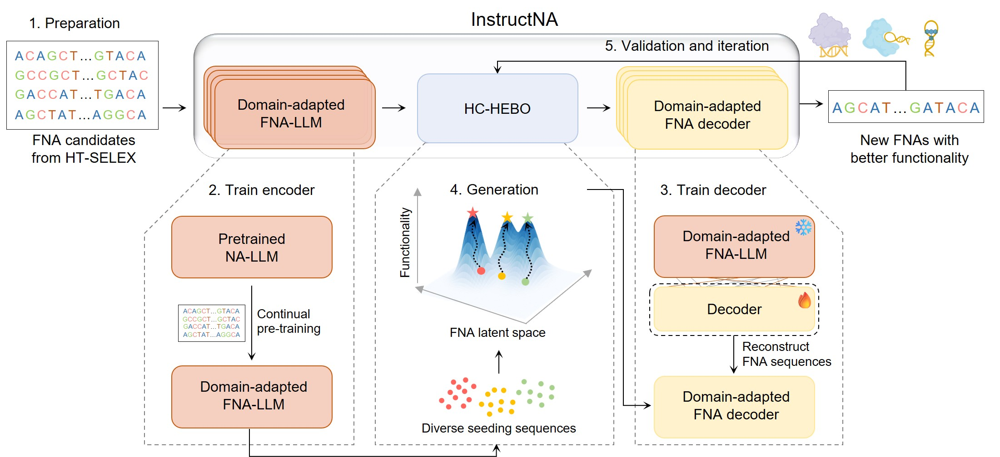

# InstructNA

**Functional nucleic acids (FNAs)** are essential for designing advanced molecular tools across multiple fields, yet their *de novo* design faces challenges due to the vast sequence space and inefficiency of experimental screening methods. Nucleic acid large language models (NA-LLMs) offer new opportunities for FNA design, but their generative capabilities remain underexplored. Here, we introduce **InstructNA**, a novel framework that leverages NA-LLMs augmented with high-throughput SELEX (HT-SELEX) to guide *de novo* design of FNAs **without relying on structural information**.



---

## Environment Setup

- **OS**: Ubuntu 20.04  
- **Python**: 3.9  
- **CUDA**: 12.6  
- **Main Dependencies**:  
  - `torch==2.7.1`  
  - `transformers==4.53.2`  
  - `HEBO==0.3.6`  

### Create Environment with Conda

```bash
conda create -n InstructNA python=3.9
conda activate InstructNA
pip install -r requirements.txt
```


## Training
The training of the InstructNA model is designed in **two stages**: the **encoder training stage** and the **decoder training stage**.
### 1. Training encoder
```bash
python examples/DNABERT_3mers/Train.py \
    --dataset_dir /path/to/unique.csv \
    --batchsize 512 \
    --train_val_split_ratio 0.9 \
    --train_epoches 50 \
    --dataloader_num_worker 64 \
    --dataset_preprocess_num_worker 8 \
    --evaluate_per_step 10 \
    --random_seeds 42 \
    --checkpoint_save_path /path/to/save_model \
    --max_checkpoint_save_num 3 \
    --wandb_exp_name None \
    --warmup_steps 100 \
    --gradient_accumulation_steps 1 \
    --lr 1e-4 \
    --device cuda \
    --train_encoder_or_decoder train_encoder \
    --fintune_encoder_weight_path None \
```

### 2. Training decoder
```bash
python examples/DNABERT_3mers/Train.py \
    --dataset_dir /path/to/unique.csv \
    --batchsize 512 \
    --train_val_split_ratio 0.9 \
    --train_epoches 50 \
    --dataloader_num_worker 64 \
    --dataset_preprocess_num_worker 8 \
    --evaluate_per_step 10 \
    --random_seeds 42 \
    --checkpoint_save_path /path/to/save_model \
    --max_checkpoint_save_num 3 \
    --wandb_exp_name None \
    --warmup_steps 100 \
    --gradient_accumulation_steps 1 \
    --lr 1e-4 \
    --device cuda \
    --train_encoder_or_decoder train_decoder \
    --fintune_encoder_weight_path /path/to/encoder_model_weight \
```

## Inference
### 1. construct seeding sequences
The prior sequences are derived from diverse sources, including:

#### 1.1 The top 10 most frequent sequences from SELEX data.  
```bash
python examples/DNABERT_3mers/seeds_construct/get_top10_from_fastq.py \
    --fastq_file /path/to/input.fastq \
    --output_csv /path/to/output_top10.csv
```
#### 1.2 Sequences generated based on the Gaussian Mixture Model (GMM) cluster centers derived from the SELEX dataset.  

```bash
python examples/DNABERT_3mers/seeds_construct/get_GMM_center_seqs.py \
  --sequences_dir /path/to/unique_seqs.csv \
  --tSNE_visual False \
  --encoder_model_path /path/to/encoder_model \
  --decoder_model_path /path/to/decoder_model \
  --output_dir /path/to/output \
```
#### 1.3 Sequences from the SELEX dataset whose embeddings are proximal to the high-functional sequences identified in (1) and (2).
```bash
python examples/DNABERT_3mers/seeds_construct/get_near_seqs.py \
  --seqs_fre_dir /path/to/seqs_fre.csv \
  --seq_acts /path/to/seqs_act.csv \
  --encoder_model_path /path/to/encoder_model \
  --decoder_model_path /path/to/decoder_model \
  --output_dir /path/to/output \
```
#### 1.4 After obtaining the sequences from steps (1), (2), and (3), cluster them to get 10 representative sequences using the following script:

```bash
python examples/DNABERT_3mers/seeds_construct/get_final_seeds.py \
  --seq_acts /path/to/Seeds_act.csv \
  --encoder_model_path /path/to/encoder_model \
  --decoder_model_path /path/to/decoder_model \
  --output_dir /path/to/output_dir \
```

### 2. Optimize the seeding sequences as following

```bash
python examples/DNABERT_3mers/single_BO_inference.py \
  --SELEX_path /path/to/SELEX_unique_seqs.csv \
  --seq_act_path /path/to/Seeds_act.csv \
  --encoder_model_path /path/to/encoder_checkpoint \
  --decoder_model_path /path/to/decoder_checkpoint \
  --BO_output_dir /path/to/output_dir \
  --search_r 5.0 \
  --max False \
  --use_filter False \
  --HC_HEBO_batchsize 20 \
  --f_primer 5_primer \
  --r_primer 3_primer
```
## A pipeline for optimizing public transcription factor binding specificity using InstructNA
To validation the performance of InstructNA. We use the public SELEX datasets from [DNA-Binding **Specificities
of Human Transcription Factors**](https://www.cell.com/cell/pdf/S0092-8674(12)01496-1.pdf), and the PBM data from the [**Evaluation of methods for modeling transcription factor sequence specificity**](https://www.nature.com/articles/nbt.2486). The pipeline script is as follows:
```bash
python examples/DNABERT_3mers/TFs_InstrcutNA_pipeline.py \
  --fastq_dir  /path/to/SELEX_fastq\
  --BO_type HC-HEBO \
  --label_dir /path/to/PBM_data \
  --encoder_model_path /path/to/encoder_checkpoint \
  --decoder_model_path /path/to/decoder_checkpoint \
  --BO_output_dir /path/to/output_dir \
  --init_search_r 5.0 \
  --min_r 1.25 \
  --BO_cycle_nums 10 \
  --bo_batchsize 10 \
```